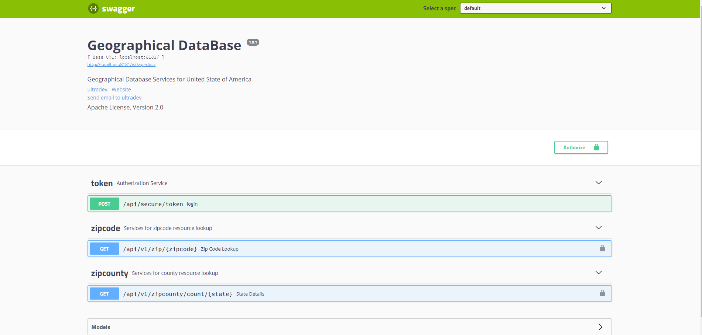
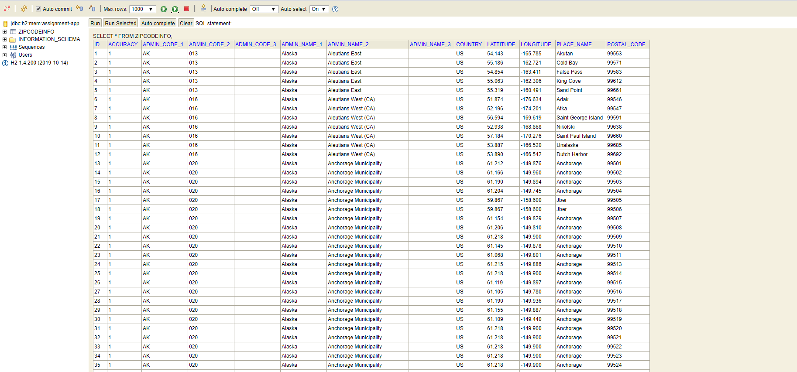

## US ZIP CODE DETAIL API( Draft)

Objective:  Build a REST API to fetch the details of a US zip code. The raw data was obtained from http://download.geonames.org/export/zip

`Endpoint:(A) http://<hostname:port>/zip/{zipid}`

`Endpoint:(B) http://<hostname:port>/zipcounty/count/{state}`

## Design/Implementation Consideration
 
- Impletation is mostly Follow SOLID Design Principles.
-  H2 is used as backend database for persisting the zip data feed.
- Swagger is used for API documentation as well as  API DEV test Tool.
- Filter Based Customized Logging for transactionId and other log enhancement info.
- Custom Exception Handling is Added for Data Layer i.e `ApiDataNotFoundException` 
- Token based Security has been implemented  for  securing end points.  (optional/configurable)
- Dozer will be used for decoupling  the response projection.  [In progress]
- Unit Testing and Code Coverage [ in progress ]
- Final Clean up [ in progress ].
- Implmentaion Time : 8 Hours (till now) 

All the In progress Item are planned to be completed by 03/12/2020.

## How To Run

1. Cone the code from https://github.com/ultra-devs/USA-Postal-Services.git

2. `cd USA-Postal-Services`

3. `mvn clean install`

4.  `mvn spring-boot:run`

5. Go to http://localhost:8181/swagger-ui.html to access the swagger  or use curl for api invocation

6. Use http://localhost:8181/console for view H2 DB console to make sure data upload is fine `use jdbc:h2:mem:assignment-app`.as JDBC URL

   

# Screens

 

 

