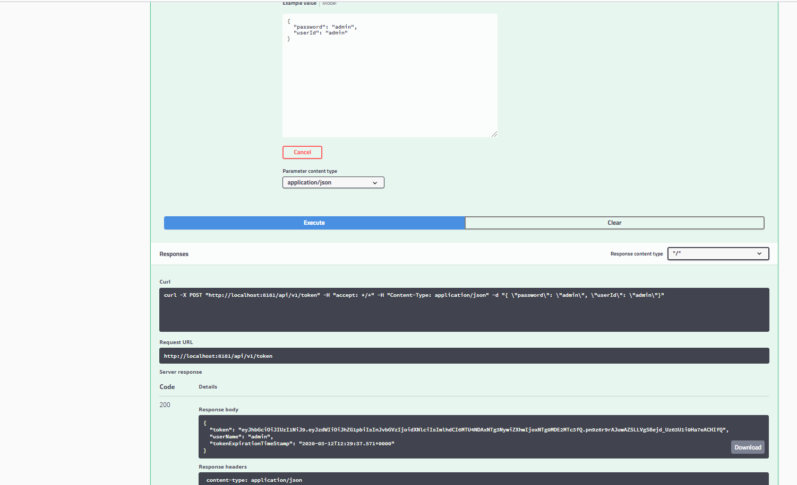
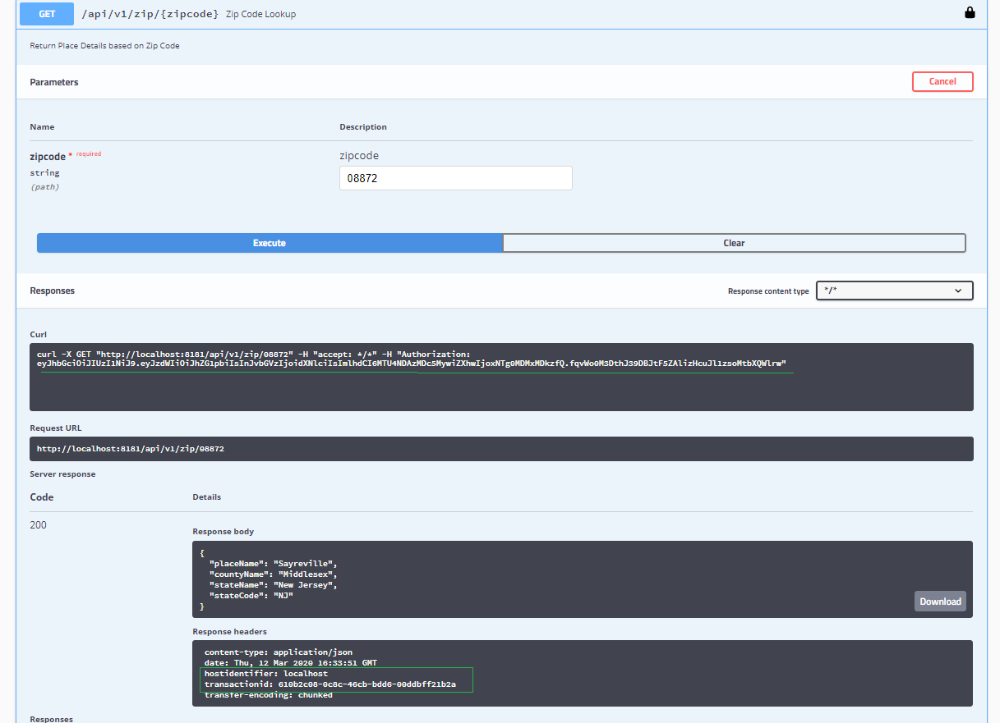
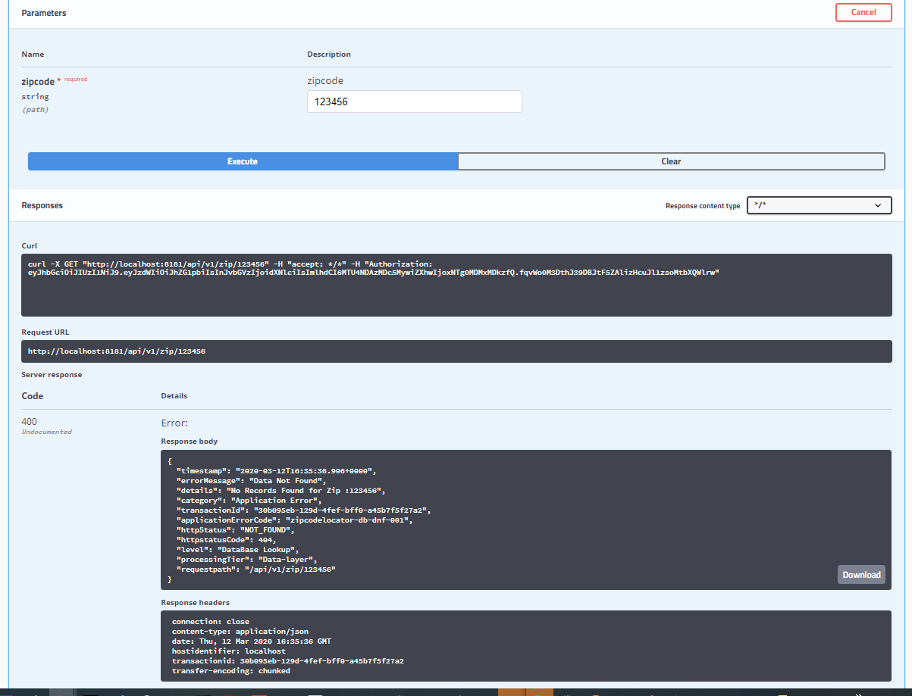
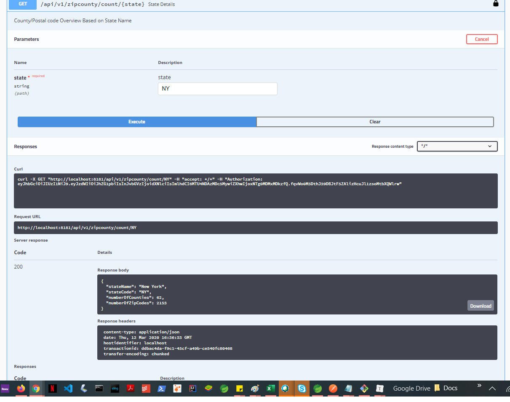

## US ZipCode/state Search APIs 

Objective:  Build a REST API to fetch the details of a US zip code. The raw data was obtained from http://download.geonames.org/export/zip

`Endpoint:(A) http://<hostname:port>/zip/{zipid}`

`Endpoint:(B) http://<hostname:port>/zipcounty/count/{state}`

## Design/Implementation Consideration

- Impletation is mostly Follow SOLID Design Principles.
-  H2 is used as backend database for persisting the zip data feed.
- Swagger is used for API documentation as well as  API DEV test Tool.
- Filter Based Customized Logging for transactionId and other log enhancement info.
- Custom Exception Handling is Added for Data Layer i.e `ApiDataNotFoundException` 
- Token based Security has been implemented  for  securing end points. User/pass(admin/admin , token expires in 5 mins configurable) (optional/configurable)
- Dozer will be used for decoupling  the response projection.  [In progress]
- Unit Testing and Code Coverage [ in progress ]
- Final Clean up [ in progress ].
- Implmentaion Time : 8 Hours (till now) 

All the In progress Item are planned to be completed by 03/12/2020.

## How To Run

1. Cone the code from https://github.com/ultra-devs/USA-Postal-Services.git

2. `cd USA-Postal-Services`

3. `mvn clean install`

4.  `mvn spring-boot:run`

5. Go to http://localhost:8181/swagger-ui.html to access the swagger  or use curl for api invocation

6. Use http://localhost:8181/console for view H2 DB console to make sure data upload is fine `use jdbc:h2:mem:assignment-app`.as JDBC URL

### API Logs

`2020-03-12 12:32:41.041 INFO [main] com.ultradev.service.FeedFileDataParsingService - [ hostname:  # version:  # conversationId :  # servicename:  ]:   T o t a l   F e e d   R e c o r d   C o u n t   :     :41469
2020-03-12 12:32:41.041 INFO [main] com.ultradev.service.FeedFileDataParsingService - [ hostname:  # version:  # conversationId :  # servicename:  ]:   F e e d   F i l e   L o a d   C o m p l e t e d   S u c c e s s f u l l y   (   T o o k   :   :00:00:00.169 )
2020-03-12 12:32:50.050 INFO [http-nio-8181-exec-1] org.apache.catalina.core.ContainerBase.[Tomcat].[localhost].[/] - [ hostname:  # version:  # conversationId :  # servicename:  ]: Initializing Spring DispatcherServlet 'dispatcherServlet'
2020-03-12 12:32:50.050 INFO [http-nio-8181-exec-1] org.springframework.web.servlet.DispatcherServlet - [ hostname:  # version:  # conversationId :  # servicename:  ]: Initializing Servlet 'dispatcherServlet'
2020-03-12 12:32:50.050 INFO [http-nio-8181-exec-1] org.springframework.web.servlet.DispatcherServlet - [ hostname:  # version:  # conversationId :  # servicename:  ]: Completed initialization in 7 ms
2020-03-12 12:33:50.050 INFO [http-nio-8181-exec-10] com.ultradev.config.ServiceInterceptor - [ hostname: localhost # version: 1.0.1 # conversationId :  # servicename: /api/v1/zip/08872 ]: A P I   T r a n s a c t i o n I d :610b2c08-0c8c-46cb-bdd6-00ddbff21b2a
2020-03-12 12:33:50.050 INFO [http-nio-8181-exec-10] com.ultradev.service.ZipCodeDataFetchService - [ hostname: localhost # version: 1.0.1 # conversationId : 610b2c08-0c8c-46cb-bdd6-00ddbff21b2a # servicename: /api/v1/zip/08872 ]: P r o c e s s i n g   Z i p   C o d e   D e t a i l s   W i t h   Z i p c o d e   :   :08872
2020-03-12 12:33:51.051 INFO [http-nio-8181-exec-10] com.ultradev.config.ServiceInterceptor - [ hostname: localhost # version: 1.0.1 # conversationId : 610b2c08-0c8c-46cb-bdd6-00ddbff21b2a # servicename: /api/v1/zip/08872 ]:  s e r v i c e - r e s p o n s e  - d u r a t i o n :  :00:00:00.172
2020-03-12 12:35:36.036 INFO [http-nio-8181-exec-2] com.ultradev.config.ServiceInterceptor - [ hostname: localhost # version: 1.0.1 # conversationId :  # servicename: /api/v1/zip/123456 ]: A P I   T r a n s a c t i o n I d :30b095eb-129d-4fef-bff0-a45b7f5f27a2
2020-03-12 12:35:36.036 INFO [http-nio-8181-exec-2] com.ultradev.service.ZipCodeDataFetchService - [ hostname: localhost # version: 1.0.1 # conversationId : 30b095eb-129d-4fef-bff0-a45b7f5f27a2 # servicename: /api/v1/zip/123456 ]: P r o c e s s i n g   Z i p   C o d e   D e t a i l s   W i t h   Z i p c o d e   :   :123456
2020-03-12 12:35:36.036 INFO [http-nio-8181-exec-2] com.ultradev.config.ServiceInterceptor - [ hostname: localhost # version: 1.0.1 # conversationId : 30b095eb-129d-4fef-bff0-a45b7f5f27a2 # servicename: /api/v1/zip/123456 ]:  s e r v i c e - r e s p o n s e  - d u r a t i o n :  :00:00:00.033
2020-03-12 12:36:33.033 INFO [http-nio-8181-exec-4] com.ultradev.config.ServiceInterceptor - [ hostname: localhost # version: 1.0.1 # conversationId :  # servicename: /api/v1/zipcounty/count/NY ]: A P I   T r a n s a c t i o n I d :ddbac4da-f9c1-45cf-a49b-ce540fc80468
2020-03-12 12:36:33.033 INFO [http-nio-8181-exec-4] com.ultradev.service.ZipCountyDataFetchService - [ hostname: localhost # version: 1.0.1 # conversationId : ddbac4da-f9c1-45cf-a49b-ce540fc80468 # servicename: /api/v1/zipcounty/count/NY ]: P r o c e s s i n g   S t a t e   D e t a i l s   W i t h   S t a t e   C o d e   :   :NY
2020-03-12 12:36:33.033 INFO [http-nio-8181-exec-4] com.ultradev.config.ServiceInterceptor - [ hostname: localhost # version: 1.0.1 # conversationId : ddbac4da-f9c1-45cf-a49b-ce540fc80468 # servicename: /api/v1/zipcounty/count/NY ]:  s e r v i c e - r e s p o n s e  - d u r a t i o n :  :00:00:00.135`

# 

## Testing

 

 

